# Medicare Part D Prescriber Spend Analysis, Texas 2022

**Data Analytics Portfolio Project | SQL, Excel, Power BI/Presentation**
Data Source: [CMS Medicare Part D Prescribers by Provider and Drug](https://data.cms.gov/provider-summary-by-type-of-service/medicare-part-d-prescribers/medicare-part-d-prescribers-by-provider-and-drug), Calendar Year 2022

---

## 📌 Project Overview

This project analyzes Medicare Part D prescriber-level drug cost data for Texas in 2022, covering four high-volume specialties: **Internal Medicine, Family Practice, Cardiology, and Psychiatry**.

The full analytics workflow (Frame, Extract, Wrangle/Prepare, Analyze, Interpret) was carried out in **PostgreSQL**, with results communicated through an **Excel workbook** (pivot tables, charts, business question answers) and a **slide presentation**, both built directly from the SQL query output. Every analysis query in the SQL file is commented with the exact Excel tab it feeds, so the SQL and the workbook tie back to each other end to end.

**Scope:** 908,137 raw rows x 22 columns extracted from CMS, filtered at download to Texas, 2022, and the four specialties above.

**Tools used:** PostgreSQL (data cleaning, wrangling, analysis) then Excel (pivot tables, charts) then PowerPoint (presentation)

---

## 🎯 Hypothesis

> Specialty type and drug choice are the primary drivers of Medicare Part D drug costs in Texas. A small number of specialties and high-cost drugs account for the majority of total spending, and providers who prescribe more brand-name drugs have a higher cost per beneficiary than those who primarily prescribe generics.

## ❓ Guiding Business Questions

1. Which of the 4 specialties accounts for the highest total Part D drug cost, and what percentage of total spend does each specialty represent?
2. Which are the top 10 most prescribed generic drugs by total claim count, and how does their cost rank compare to their claim count rank?
3. What is the average drug cost per claim by specialty, and which specialty shows the largest gap between total claims and total drug cost?
4. Which specialty has the highest cost per beneficiary in Texas, and which has the lowest?
5. Which cities in Texas have the highest concentration of high-cost prescribers, and does location within Texas influence total drug spend?
6. Who are the top 20 individual prescribers by total drug cost, and what specialties do they represent?
7. Do providers who prescribe brand-name drugs spend more per patient than providers who primarily prescribe generic drugs?
8. Which drugs are being prescribed to the largest number of unique patients, and which drugs are being prescribed most repeatedly to the same patients?
9. How does prescribing volume and cost differ for beneficiaries aged 65 and older compared to the total beneficiary population?
10. Are there individual providers whose total drug costs are significantly higher than other providers in the same specialty, and could they warrant further review?

---

## 🖥️ Chart Gallery

### Q1: Total Drug Cost by Specialty
Family Practice and Internal Medicine drive the vast majority of Part D spend.

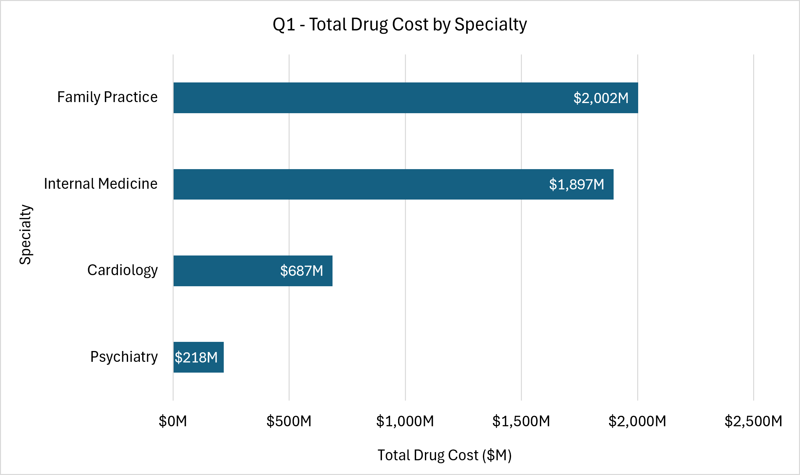

### Q2: Claim Rank vs. Cost Rank
Furosemide stands out as an outlier, ranked 10th by claim volume but by far the highest cost rank of any top-10 generic drug.

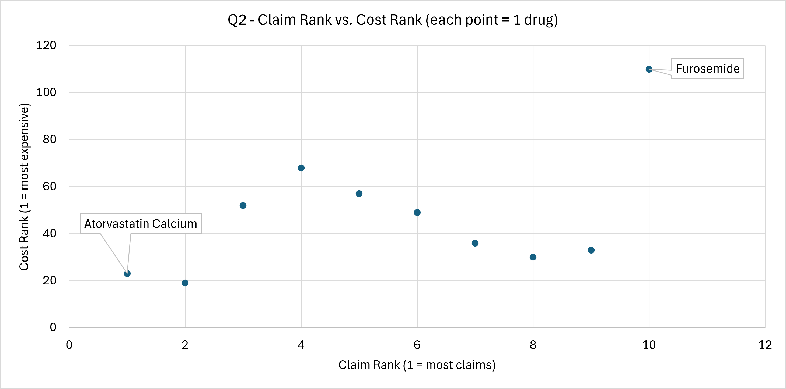

### Q3: Claims Share vs. Cost Share by Specialty
Cardiology's cost share (14.3%) outpaces its claims share (8.8%) by the widest margin of any specialty, meaning it consumes a disproportionate share of total spend relative to its prescribing volume.

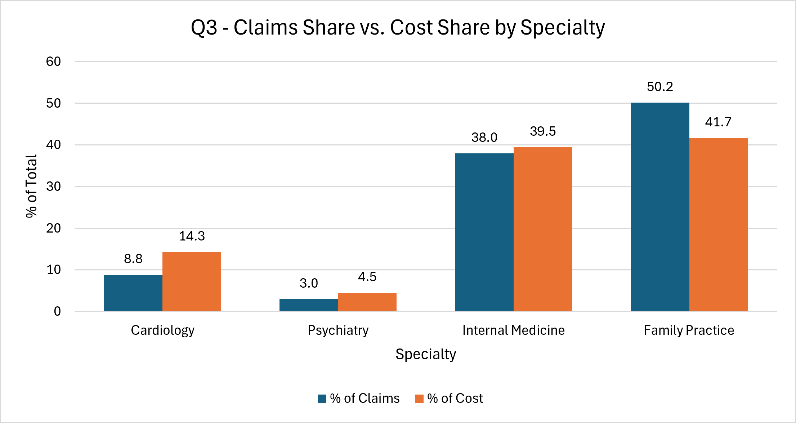

### Q4: Cost per Beneficiary by Specialty
Cardiology has the highest cost per beneficiary ($442) of any specialty, nearly 3x Family Practice ($151), despite Family Practice driving far more total spend overall.

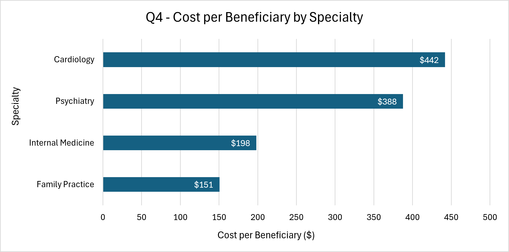

### Q5: Total City Cost vs. High-Cost Prescriber Concentration
Houston has by far the highest total cost ($603M) but one of the lowest shares of high-cost prescribers (20.5%). Mcallen, a much smaller market, has the highest concentration of high-cost prescribers (38.6%).

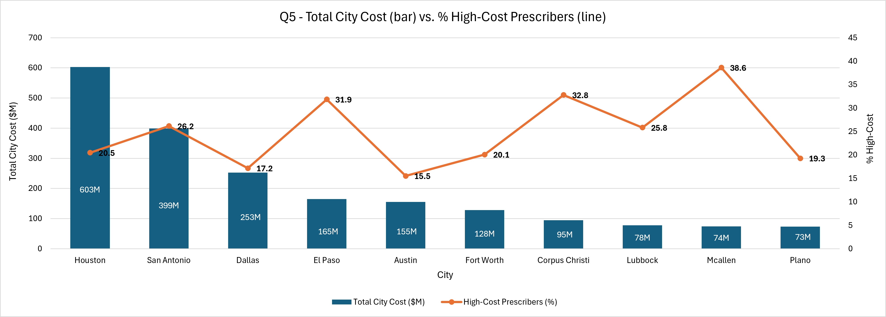

### Q6: Top 10 Prescribers by Total Drug Cost
Nina Olvera tops the list at $23.7M, well ahead of the next closest prescriber.

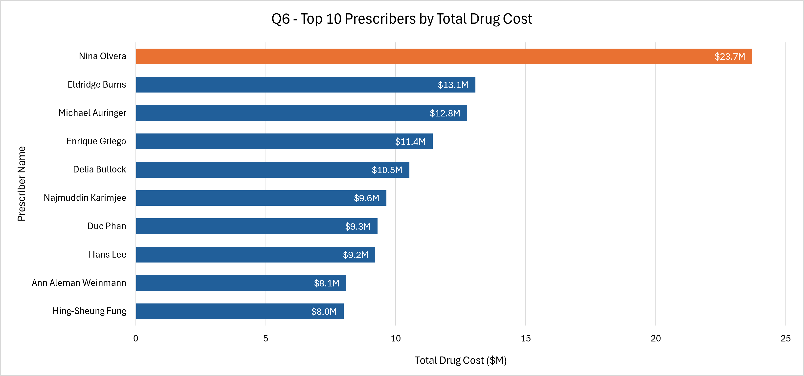

### Q7: Cost per Patient, Brand-Name vs. Generic Prescribers
Providers who primarily prescribe brand-name drugs cost 10.6x more per patient ($1,615) than providers who primarily prescribe generics ($152), the strongest single piece of evidence for the hypothesis.

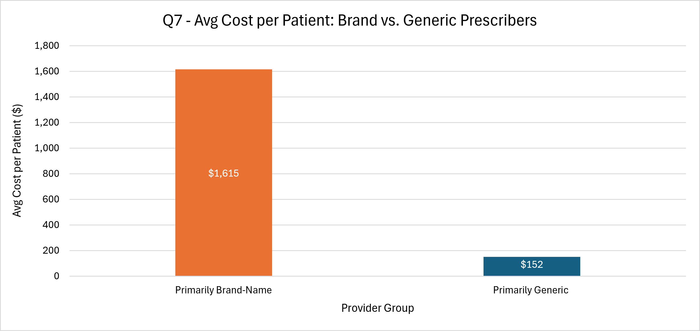

### Q8a: Top 10 Drugs by Unique Patients
Atorvastatin Calcium reaches the most unique patients (930K), consistent with its role as a common maintenance medication.

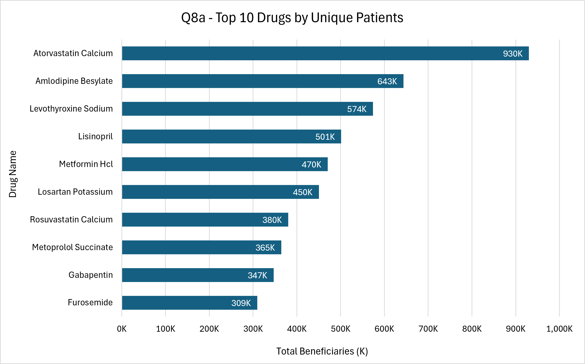

### Q8b: Top 10 Drugs by Claims per Beneficiary
Clozapine is refilled most repeatedly per patient (11.1 claims per beneficiary), reflecting the frequent monitoring required for chronic psychiatric and specialty conditions.

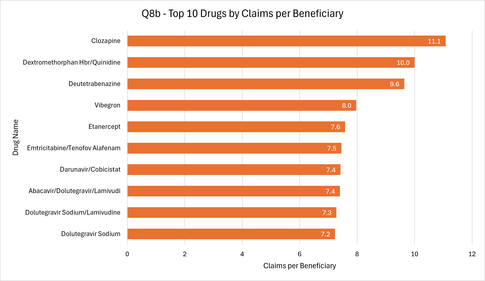

### Q9: Age 65+ Share of Claims and Total Cost
Beneficiaries aged 65+ account for 56.2% of total claims and 51.5% of total drug cost, a disproportionate share relative to their share of the overall beneficiary population.

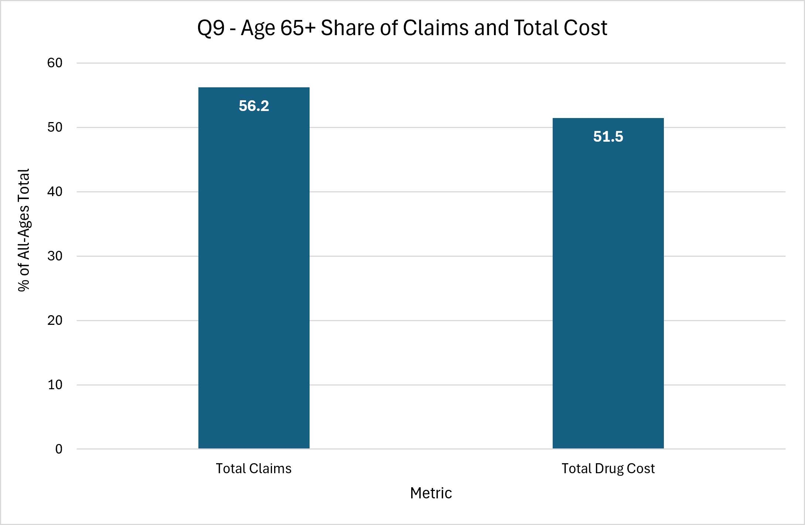

### Q10a: Provider Cost Outliers
Nina Olvera's total drug cost ($23.7M) is a significant statistical outlier relative to other providers in her specialty.

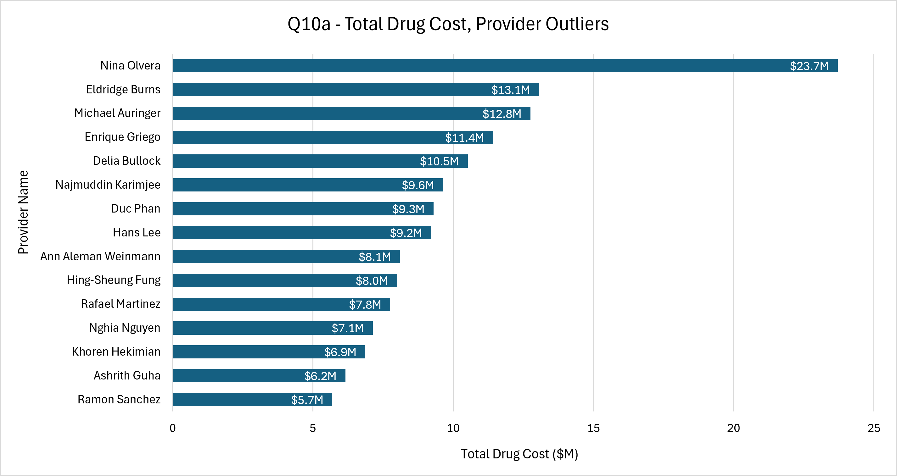

### Q10b: Provider Cost Distribution by Specialty
The full distribution of provider costs by specialty, with outliers (orange) plotted against the typical range (box) for each specialty. Family Practice and Internal Medicine show the widest spread and the most extreme outliers.

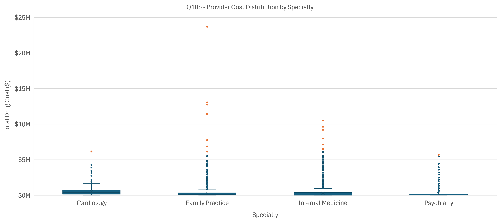

---

## 🔑 Key Findings

1. **Family Practice drives the highest total spend ($2,002M), but Cardiology drives the highest cost intensity.** Cardiology has both the highest average cost per claim ($152.65, calculated from the underlying cost-per-claim analysis) and the highest cost per beneficiary ($442), despite having the smallest total spend ($687M) of the four specialties.

2. **Brand-name prescribing is the single strongest cost driver identified.** Providers who primarily prescribe brand-name drugs cost 10.6x more per patient than generic-focused prescribers ($1,615 vs. $152), directly supporting the project hypothesis.

3. **Beneficiaries 65+ carry a disproportionate share of both volume and cost.** This group accounts for 56.2% of total claims and 51.5% of total drug cost.

4. **Geographic cost concentration does not track total spend.** Houston has the highest total city cost ($603M) but one of the lowest shares of high-cost prescribers (20.5%), while Mcallen, a much smaller market, has the highest share (38.6%), showing that total dollars and prescriber risk concentration are two different signals.

5. **A small number of individual prescribers account for outsized cost.** The top provider, Nina Olvera, prescribed $23.7M in total drug cost, a statistical outlier well beyond the typical range for her specialty, flagging a clear candidate for further review.

---

## 🧹 Data Handling Notes

- Row-level data with fewer than 11 total claims per provider-drug combination is excluded from the CMS source file before extraction (a CMS suppression rule, not a cleaning decision made in this project). This means all totals slightly undercount true low-volume prescribing.
- All columns were imported as TEXT in the raw staging table and explicitly cast in a later cleaning step, since the source file mixes numeric values with blank cells for CMS-suppressed data, which would break a direct NUMERIC import.
- Full step-by-step cleaning documentation lives in the Excel workbook's Data Handling Summary tab.

---

## 📁 Repository Structure

```
Medicare-PartD-2022/
├── README.md
├── Medicare Part D Presentation.pptx                                  # Slide deck summary
├── Medicare_Part_D_Prescribers_by_Provider_and_Drug_2022_Workbook.xlsx # Excel workbook: pivots, findings, charts
├── MedicarePartD_SQL_Queries.sql                                      # Full SQL workflow: extract, wrangle, analyze
└── Charts/
    ├── Q1-SpendBySpecialty.png
    ├── Q2-TopGenericDrug.png
    ├── Q3-CostPerClaimSpecialty.png
    ├── Q4-CostPerBeneSpecialty.png
    ├── Q5-HighCostCities.png
    ├── Q6-Top20Prescribers.png
    ├── Q7-BrandVsGeneric.png
    ├── Q8a-DrugsbyUniquePatient.png
    ├── Q8b-DrugsByClaims.png
    ├── Q9-Ge65VsAll.png
    ├── Q10a-ProviderCostOutliers.png
    └── Q10b-ProviderCostDistribution.png
```

---

## 🛠️ Tools & Skills Demonstrated

- **SQL (PostgreSQL):** Data extraction, type casting, cleaning, aggregation, and the full analytical workflow behind all 10 business questions
- **Excel:** Pivot tables, chart building, findings documentation
- **Presentation:** Communicating technical findings to a non-technical audience
- **Analytical skills:** Cost driver analysis, geographic benchmarking, outlier detection, specialty and drug-level cost segmentation
